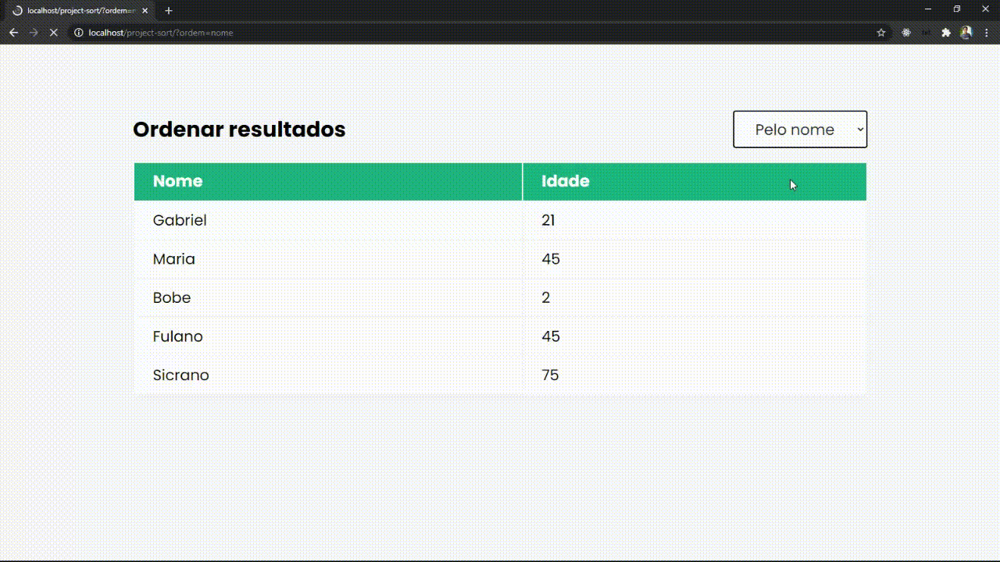

# Project sort

> Dedicated project to test what I'm learning with PHP. 

Projeto de ordenação de resultados com conexão ao banco de dados

`Web preview`

## Release history

* 0.1.0
    * Project finalized and studying the possibility of adding `new resources`
* 0.0.1
    * Work in `progress`

## Meta

Gabriel de Jesus - (https://www.gabrieldesenvolvedor.com/) – oi@gabrieldesenvolvedor.com

Distributed under the MIT License. See `LICENSE` for more information.

[https://github.com/devgabrieldejesus/project-sort](https://github.com/devgabrieldejesus/)

## Contributing

1. Fork it (<https://github.com/devgabrieldejesus/project-sort/fork>)
2. Create your feature branch (`git checkout -b feature/fooBar`)
3. Commit your changes (`git commit -am 'Add some fooBar'`)
4. Push to the branch (`git push origin feature/fooBar`)
5. Create a new Pull Request
